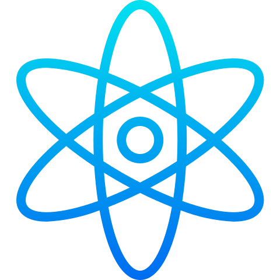

## Abdout me

**Name:** Mukhammadyusuf Abdurakhimov

**Title:** Junior Software Engineer

#### Personal achivements:

✅ UNDP Award of best Startup of 2021  
✅ Most Active Student of 2020  
✅ Succesful participant of multiple local and global Hackathons of 2020 - 2021 ranking 1st, 2nd and 3rd places.

## Contacts

**Phone:** +998932499099

**Email:** icoderx@yandex.ru

**LinkedIn:** https://linkedin.com/in/mrabdurakhimov

## Languages and tools

#### Programming languages:

 

#### IDE

<!--  -->
 

#### Frontend

 

#### Backend

 

#### Other tools

